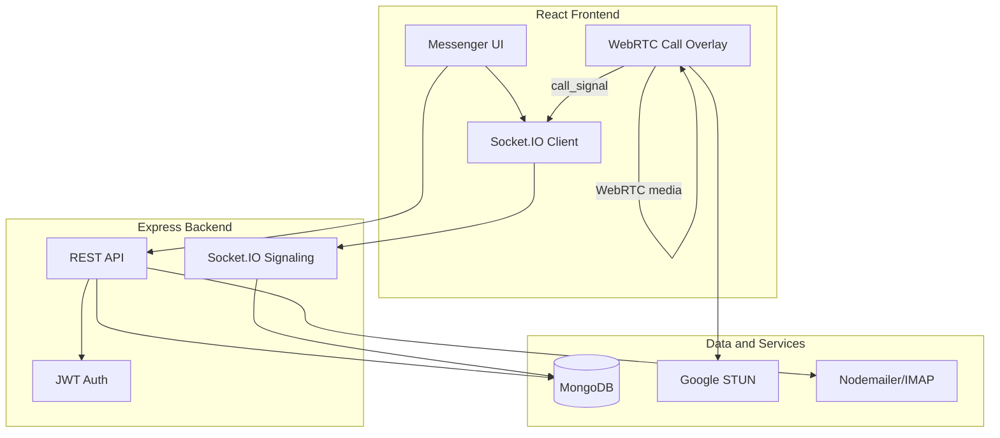

# OmniComm — Real-Time Communication Platform

A full-stack messenger with in-app WebRTC audio/video calls, file attachments, and an email demo — built to demonstrate production patterns for portfolio and freelance work.


<!-- ## Live Demo

**Frontend:** https://your-app.vercel.app  
Log in as `demo1@omnicomm.app` or `demo2@omnicomm.app` (password: `Demo1234!`) in two browser tabs to test chat and calls. -->

<!-- ## Demo Recording

 -->

## Case Study

| | |
|---|---|
| **Problem** | Build a portfolio-grade messenger with in-app calls, without paid telecom APIs or services that require billing setup. |
| **Constraints** | No Twilio/Daily billing; embeddable third-party call widgets blocked by lobby/CSP policies; JWT-only auth throughout. |
| **Solution** | Custom WebRTC (`simple-peer`) with Socket.IO signaling, optimistic chat UI, JWT-protected attachments, and a shared Gmail demo inbox. |
| **Trade-offs** | STUN-only WebRTC (may fail on strict NATs without TURN); shared email inbox for demo simplicity. |
| **Outcome** | Deployable MERN app with real-time chat, ringing calls, file sharing, and email integration. |

## Features

- **Messenger-style chat** — conversation list, typing indicators, online presence, read receipts
- **File attachments** — images with lightbox preview and download; JWT-protected file serving
- **In-app audio/video calls** — WebRTC peer-to-peer with Socket.IO signaling and ringtone
- **Email (demo)** — two-pane inbox, HTML rendering (DOMPurify), Nodemailer send + IMAP fetch

## Architecture



## Key Technical Decisions

- **WebRTC over embedded Jitsi** — Jitsi free tiers required payment methods or blocked iframe embeds (`membersOnly` lobby, CSP `frame-ancestors`). Custom `simple-peer` + Socket.IO signaling avoids third-party billing and embed restrictions.
- **JWT socket auth** — Socket.IO middleware verifies tokens on connect; no anonymous sockets.
- **Signaling vs media separation** — Socket.IO handles ring/accept/decline/signal exchange; WebRTC handles audio/video media directly between peers.
- **Optimistic UI** — messages appear instantly with sending → delivered → seen states.
- **Authenticated attachment URLs** — chat files fetched via axios + blob URLs (`img` tags cannot send JWT headers).
- **HTML email sandbox** — incoming HTML rendered on a light “paper” surface in dark mode so inline email styles stay readable.

## Tech Stack

| Layer | Technology |
|-------|------------|
| Frontend | React, Vite, Tailwind CSS, Socket.IO Client, simple-peer (WebRTC) |
| Backend | Node.js, Express, Socket.IO, Mongoose |
| Database | MongoDB |
| Real-time | Socket.IO (chat + call signaling) |
| In-app calls | WebRTC + Google STUN |
| Email | Nodemailer + IMAP, DOMPurify |

## Setup

### Prerequisites

- Node.js 18+
- MongoDB
- Gmail app password (optional, for email demo)

### Backend

```bash
cd backend
cp .env.example .env
# Fill in your credentials
npm install
npm run dev
```

Demo users (`demo1@omnicomm.app`, `demo2@omnicomm.app`) are created automatically on startup if they don't exist.

### Frontend

```bash
cd frontend
cp .env.example .env
npm install
npm run dev
```

### Environment Variables

See [`backend/.env.example`](backend/.env.example) and [`frontend/.env.example`](frontend/.env.example).

| Variable | Description |
|----------|-------------|
| `MONGO_URI` | MongoDB connection string |
| `JWT_SECRET` | Secret for JWT signing |
| `CLIENT_URL` | Frontend URL (CORS + OAuth redirect) |
| `API_URL` | Backend public URL (production) |
| `FROM_EMAIL` / `FROM_PASSWORD` | Shared Gmail for email demo |
| `VITE_API_URL` | Backend URL for frontend |
| `VITE_DEMO_URL` | Optional live demo URL shown on Home page |

## Deployment

### Frontend (Vercel)

1. Import the repo and set **Root Directory** to `frontend`.
2. Add env var: `VITE_API_URL=https://your-api.onrender.com`
3. Optional: `VITE_DEMO_URL=https://your-app.vercel.app`
4. Deploy — `vercel.json` handles SPA routing.

### Backend (Render)

1. Create a **Web Service** from this repo (or use [`render.yaml`](render.yaml)).
2. Set **Root Directory** to `backend`.
3. Add env vars from `.env.example` (`MONGO_URI`, `JWT_SECRET`, `CLIENT_URL`, etc.).
4. Set `CLIENT_URL` to your Vercel frontend URL.
5. Set `API_URL` to your Render backend URL.

### After deploy

- Update Google OAuth callback URLs if using Google login.
- Allow Gmail app password on the demo account.
- Demo users seed automatically on first backend boot.
<!-- - Record a demo GIF — see [`docs/DEMO.md`](docs/DEMO.md). -->

## Socket Events

| Event | Direction | Description |
|-------|-----------|-------------|
| `private_message` | server → client | New message received |
| `message_sent` | server → sender | Message saved confirmation |
| `typing_start` / `typing_stop` | bidirectional | Typing indicators |
| `message_read` / `read_receipt` | bidirectional | Read receipts |
| `presence_update` | server → all | Online user list |
| `call_invite` | server → callee | Incoming call ring |
| `call_signal` | bidirectional | WebRTC signaling data |
| `call_accepted` / `call_declined` | server → caller | Call response |
| `call_ended` | server → partner | Call terminated |

## API Endpoints

| Endpoint | Method | Auth | Description |
|----------|--------|------|-------------|
| `/api/auth/register` | POST | No | Register user |
| `/api/auth/login` | POST | No | Login |
| `/api/chat/conversations` | GET | Yes | Conversation list |
| `/api/chat/history/:id` | GET | Yes | Message history |
| `/api/chat/upload` | POST | Yes | Upload attachment |
| `/api/calls/start` | POST | Yes | Start in-app call |
| `/api/calls/accept` | POST | Yes | Accept call |
| `/api/emails/send` | POST | Yes | Send email |
| `/api/emails/receive` | GET | Yes | Fetch inbox |

## Email Demo Note

Email uses a **shared sender account** for demo purposes — all logged-in users see the same inbox. Inbox shows the **20 most recent emails** from the last 30 days (read + unread).

## Testing

```bash
# Backend
cd backend && npm test

# Frontend
cd frontend && npm test
```

## Out of Scope (by design)

SMS and PSTN phone integrations were intentionally excluded — they require paid telecom infrastructure and public webhooks.

## Roadmap

- TURN server for WebRTC behind strict NATs
- Group chats and group calls
- Message search, reactions, threads
- TypeScript migration

## License

ISC
